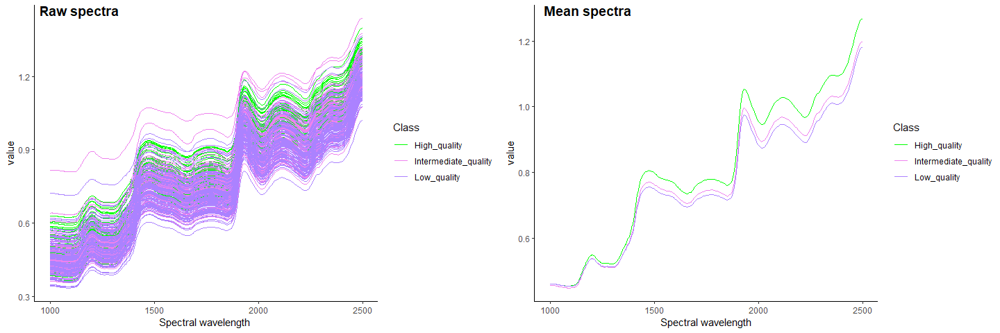
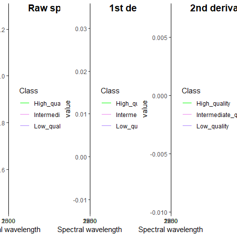

`niradm`: Basic analysis of near-infrared data
==============================================

> This package uses functions developed from the following packages:
> `pls, prospectr, dplyr, reshape2, ggplot2, ggpubr, factoextra,  FactoMineR`.
> We thank the creators of these useful packages.

**Warning**:

-   The data structure must be in Dataframe format. Use the following
    command to transform it into a dataframe:
    `data<-as.data.frame(data)`

-   The package is under development and was made for the specific needs
    of our laboratory.

Installation and loading
------------------------

-   install the latest version from
    [GitHub](https://github.com/admedeiros/niradm-package) as follow:

<!-- -->

    #Install
    if(!require(devtools)) install.packages("devtools")
    if(!require(niradm)) devtools::install_github("admedeiros/niradm-package")

    #Load package
    library(niradm)

Main functions:
---------------

`vizplotmean_df()`: Create graphics with the average of the spectra
class.

`vizplotraw_df()`: Create graphics with the raw of the spectra class.

`center_df()`: Center the data on the average.

`autoscaling_df()`: Autoscaling the data using the Z-score
transformation.

`snv_df()`: Standard Normal Variate (SNV) on near-infrared (NIR) data.

`msc_df()`: Multiplicative Scatter Correction (MSC) on near-infrared
(NIR) data.

`der_df()`: Applying derivatives with Savitzky-Golay smoothing..

`pca`: Plots a graph of the major component analysis.

Examples
--------

### Spectra Visualization

    # raw spectra
    vizplotraw(nir_seed)

<!-- -->

    # mean spectra per class
    vizplotmean(nir_seed)

<!-- -->

### View of the exploratory principal component analysis

    pca(nir_seed,1,2)

<!-- -->

### Autoscaling and center

    library(ggpubr) #for ggarrange
    data(nir_seed)
    dados<-scale_center(nir_seed)
    a<-vizplotmean(nir_seed)
    b<-vizplotmean(dados)
    ggarrange(a, b,
      labels = c("A", "B"),
      ncol = 2, nrow = 1)

<!-- -->

### Applying derivatives with Savitzky-Golay smoothing

    data(nir_seed)
    a<-vizplotmean(nir_seed)

    #Applying 1st derivative with Savitzky-Golay smoothing.
    dados<-der_SG(nir_seed,1,2,11)
    b<-vizplotmean(dados)

    #Applying 2nd derivative with Savitzky-Golay smoothing.
    dados<-der_SG(nir_seed,2,2,11)
    c<-vizplotmean(dados)
    ggarrange(a, b, c, 
    labels = c("A", "B", "C"),
    ncol = 2, nrow = 2,  widths = 15,
      heights = 10)

<!-- -->
